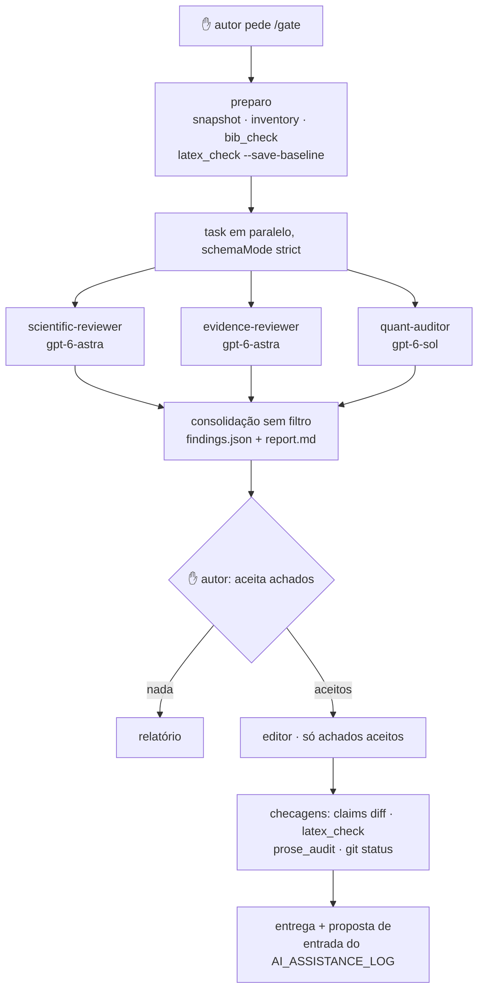

# Arquitetura

Camadas, papéis e o fluxo do ambiente — com o motivo de cada decisão. Fontes com data e
URL em `research.md`, decisões finais em `decisoes.md`, resultados de executar o ambiente
em `evaluation.md`.

## Camadas (de permanente a transitório)

| Arquivo | O que é | Quem lê | Peso aprox. |
|---|---|---|---|
| `AGENTS.md` | Contexto de engenharia (pré-existente, intocado) | toda sessão principal | 4,6 mil tokens |
| `.omp/RULES.md` | Invariantes científicos, *sticky* e repassados a subagentes (`rules: session.rules`, `task/structured-subagent.ts:511`) | dados | 415 B |
| `.omp/config.yml` | Papéis científicos de modelo + fallbacks | sessão principal e subagentes | 1,6 mil tokens |
| `.omp/science/overlay.yml` | Isolamento do perfil (`--config` no launcher) | sessão científica | 2,7 mil tokens |
| `.omp/science/models.yml` | Credenciais emprestadas do perfil padrão (`apiKey: "!… omp token <provedor>"`); o launcher o copia para o `models.yml` do perfil | sessão científica e subagentes | 1 kB |
| `.omp/science/CONTEXT.md` | Contexto da sessão principal (`--append-system-prompt`) | sessão científica, **não** subagentes | 2,9 mil tokens |
| `.omp/agents/*.md` | Cinco agentes com schema de saída | subagentes `task` | 0,6–4,5 mil cada |
| `.omp/skills/` | 7 skills com `references/` sob demanda | agentes e sessão | ~5 mil cada |
| `.omp/commands/` | 6 comandos (roteiros) | sessão principal | 0,8–3,2 mil cada |
| `scripts/science/` | verificação determinística | executor, revisores | ~10 mil por script |
| `scripts/omp-science` | launcher (perfil, overlay, contexto, check) | você | — |
| `.omp/runs/` | Saída da rodada (gitignored) | por rodada | — |

## Papéis de modelo

| Papel | Modelo | Fallback |
|---|---|---|
| `writer` | `anthropic/claude-opus-5-5:high` | opus-5 → sonnet-5 |
| `editor` | `anthropic/claude-opus-5-5:high` | opus-5 → sonnet-5 |
| `scientific_review` | `openai-codex/gpt-6-astra:high` | gpt-6-sol → gpt-5.6-sol |
| `evidence_review` | `openai-codex/gpt-6-astra:medium` | gpt-6-sol → gpt-5.6-sol |
| `quant_audit` | `openai-codex/gpt-6-sol:medium` | gpt-5.6-terra → sonnet-5 |

Papéis embutidos do perfil (overlay): `tiny`, `smol`, `commit` gpt-6-luna; `task`,
`vision` sonnet-5. `modelRoles.default` fica vazio: a sessão abre com `--model @writer`.
Regra de independência: revisores em família de modelo diferente do escritor, e os
fallbacks configurados de cada papel (`retry.fallbackChains`) **não cruzam famílias**.
Exceção que a configuração não controla: subagente cujo modelo não tem credencial no perfil
roda no modelo da sessão principal (`resolveModelOverrideWithAuthFallback`, OMP v18.3.0), com
aviso só no log. No teste C, com a cota do Codex esgotada, o revisor também caiu em
`claude-opus-5-5` (`evaluation.md`). Por isso o OMP normal precisa estar logado nos dois
provedores (o perfil científico usa essas credenciais) e o `/gate` registra o modelo
resolvido de cada revisor. `modelRoleStorage: project` → troca via
`/model` grava em `.omp/config.yml` (revisável por `git diff`).

## Fluxo `/gate`



## Fluxo diário

```
autor → sessão científica (@writer, Opus 5.5)
  /revise  → skill de prosa · snapshot · edição mínima · claims diff + prose audit · diff
  /draft-section → agente writer (contexto limpo) → candidato → /gate sugerido
```

A sessão principal nunca valida cientificamente o texto que produziu; para isso existe
o `/gate` com revisores independentes.

## Saída estruturada dos revisores

`summary`, `findings[]` (id, severity critical/major/minor, confidence alta/média/baixa,
type ∈ {overclaim, causal, generalization, methodology, statistics, citation, reference,
numeric, consistency, terminology, language, latex, other}, location, claim literal,
evidence, problem, recommended_action, requires_human_judgment), `coverage[]` (conferido
e correto) e `not_checked[]`. `schemaMode: strict` no `task`: subagente que não produzir
JSON válido falha. `confidence` é indicação operacional, não probabilidade.

## Skills (progressive disclosure)

O system prompt carrega só `name` + `description` por skill; o corpo chega via
`skill://nome/references/arquivo` quando a tarefa pede.

| Skill | Referências |
|---|---|
| `scientific-writing-ptbr` | `estilo.md`, `voz.md`, `terminologia.md` |
| `scientific-argumentation` | `checklist-emo.md` (25 itens com fonte) |
| `evidence-verification` | auto-contida |
| `quantitative-audit` | auto-contida |
| `thesis-structure` | `normas-ppgcc-ufg.md` |
| `latex-scientific-quality` | auto-contida |
| `ai-provenance` | auto-contida (Portaria CNPq 2.664/2026) |

## Onde cada decisão vive

| Mudar | Vai em |
|---|---|
| modelo de um papel | `.omp/config.yml` → `modelRoles` |
| fallback | `.omp/config.yml` → `retry.fallbackChains` |
| postura de revisor | `.omp/agents/<agente>.md` (corpo) |
| estilo, voz, terminologia | `.omp/skills/scientific-writing-ptbr/references/*` |
| checklist de domínio | `.omp/skills/scientific-argumentation/references/checklist-emo.md` |
| normas institucionais | `.omp/skills/thesis-structure/references/normas-ppgcc-ufg.md` |
| regras LaTeX | `.omp/skills/latex-scientific-quality/SKILL.md` |
| flags do ambiente | `scripts/omp-science` |
| invariantes | `.omp/RULES.md` |

## Premissas do OMP v18.3.0 que moldaram o desenho

- Subagentes não recebem `AGENTS.md` (`structured-subagent.ts:506`) nem
  `--append-system-prompt` da sessão principal; recebem `RULES.md` e skills.
  Contexto de revisor: skill carregada + dados da tarefa.
- `.omp/AGENTS.md` sombrearia o `AGENTS.md` da raiz para todos os perfis — não criado.
- `modelRoleStorage: project` funciona do projeto e o `/model` grava nele.
- `bash.patterns` de `deny` vale dentro de subagentes em modo yolo — é a barreira que
  protege o estado não commitado do autor.
- `--alias` do OMP não faz `cd` nem overlay → launcher próprio; alias nativo é opcional.
