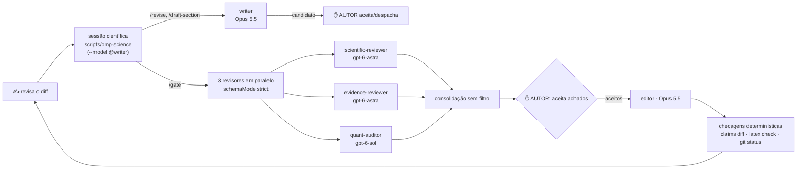

# Guia de uso — ambiente de escrita científica

## Iniciar

```bash
scripts/omp-science
```

- abre a raiz do repositório e a sessão no papel `writer` (Opus 5.5), com o contexto
  científico, as skills e os comandos de `.omp/`;
- **login:** nenhum no perfil científico. Ele usa as credenciais do seu OMP normal: o
  launcher instala `.omp/science/models.yml` como `models.yml` do perfil, e o OMP roda
  `omp token <provedor>` no perfil padrão quando precisa de token. Só o perfil padrão
  renova o OAuth. Requisito: o OMP normal logado em `anthropic` e `openai-codex`
  (`omp login <provedor>`); o login mensal da Anthropic vale para os dois. `/login` dentro
  da sessão científica não tem efeito, porque o `models.yml` tem precedência sobre credencial
  guardada. Sem credencial do `openai-codex`, os revisores do `/gate` rodam no modelo da
  sessão principal (Opus, a família do escritor) sem erro: o OMP troca o modelo de um
  subagente sem credencial pelo da sessão e só registra no log
  (`resolveModelOverrideWithAuthFallback`, v18.3.0). Confira o modelo exibido para cada
  revisor;
- diagnóstico sem chamar modelo: `scripts/omp-science --check`.

Sair: padrão OMP (`Ctrl+C`×2). O perfil padrão do seu OMP (fora deste repo) não sofre
nenhuma alteração.

## Escrever (regime diário)

```
/revise thesis/masters/tex/cap_IV.tex:120-160 enxugar a primeira frase
```

ou, na sessão, `Revise o trecho X do cap. IV para clareza, sem mudar números`.

O que acontece: abre a skill `scientific-writing-ptbr`, faz snapshot (`claims.py
snapshot`), edita uma vez, roda `claims.py diff` + `prose_audit.py` e mostra o diff com
o bloco "guarda" — o que mudou de números, citações, rótulos e marcadores de força, e o
que precisa de justificativa. Nenhum revisor é acionado.

Para redigir seção nova (com contexto limpo), `/draft-section`; escreve com o agente
`writer` (subagente sem memória da conversa) e entrega `candidato` + `decisions` +
`pending` — a recomendação normal é passar por `/gate` depois.

## Revisar seção: `/gate`

```bash
/gate thesis/masters/tex/cap_VI.tex:1-200         # trecho
/gate thesis/masters/tex/cap_VI.tex              # arquivo inteiro
/gate thesis/masters/tex/cap_I.tex paper/clei2026/main.tex:200-260   # outro manuscrito
```

O que acontece:

1. **preparação** — snapshot, inventário de números, `bib_check.py` das chaves citadas,
   `latex_check.py --save-baseline`;
2. **revisores independentes, em paralelo** — `scientific-reviewer` (gpt-6-astra),
   `evidence-reviewer` (gpt-6-astra), `quant-auditor` (gpt-6-sol); ninguém vê o outro; a saída
   é JSON estrito;
3. **consolidação sem filtro** — tabela com todos os achados, por severidade, sem mesclar,
   descartar ou suavizar; grava `findings.json` + `report.md` em `.omp/runs/`;
4. **aceite do autor** — a sessão pergunta (ferramenta `ask`) que achados aceitar; achado
   com `requires_human_judgment: true` só entra com a decisão escrita;
5. **editor** — altera apenas o necessário para resolver os achados aceitos, registrando
   antes→depois por achado; nada de nova afirmação;
6. **checagens** — `claims.py diff`, `prose_audit.py`, `latex_check.py --compare` e
   `git status` comparado ao estado inicial;
7. **entrega** — diff, achados aplicados e pulados, resultado das checagens, pendências; e
   proposta da entrada de `AI_ASSISTANCE_LOG.md` (grava só com seu ok).

## Auditar capítulo

Mesmo comando com o capítulo inteiro como alvo — os três revisores cobrem o capítulo; a
consolidação ganha uma seção de consistência com os capítulos vizinhos.

```bash
/gate thesis/masters/tex/cap_VII_complementares.tex
```

## Verificar referências

```bash
/verify-evidence thesis/masters/tex/cap_II.tex      # texto: citações e suporte
/verify-evidence holm1979simple                     # uma chave BibTeX
```

Executa `bib_check.py --online` (metadados, DOI inexistente, retratação) e despacha o
revisor de evidência para a correspondência afirmação→fonte (mostra também o que não
pôde conferir). Sem rede, o mesmo comando roda offline (consistência interna apenas:
duplicatas, campos, chaves citadas × `.bib`). Não edita o `.bib` — a entrada nova é
decisão do autor.

## Verificar números

```bash
/audit-numbers thesis/masters/tex/cap_VI.tex:1-80
```

Inventário + agente `quant-auditor` (somente leitura); ao fim mostra a cobertura (números
verificados com a fonte) e compara `git status` ao estado inicial.

## Checagem ao fim do dia (`/final-pass`)

```bash
/final-pass            # dissertação inteira, determinístico + consistência
```

Checagens da dissertação completa (`thesis-doctor`, tabelas, build, bibliografia,
inventário de números, grep de versionamento, `verify-release`, `make test`) e uma
revisão de consistência entre capítulos. Não edita.

## Trocar modelos

```yaml
# .omp/config.yml
modelRoles:
  writer: anthropic/claude-opus-5-5:high
  editor: anthropic/claude-opus-5-5:high
  scientific_review: openai-codex/gpt-6-astra:high
  evidence_review: openai-codex/gpt-6-astra:medium
  quant_audit: openai-codex/gpt-6-sol:medium
retry:
  fallbackChains:
    writer:
      - anthropic/claude-opus-5:high
      - anthropic/claude-sonnet-5:high
    scientific_review:
      - openai-codex/gpt-6-sol:high
      - openai-codex/gpt-5.6-sol:high
    # ...
```

Troque apenas o selector depois do nome do papel (`modelRoles.<papel>`). Fallback fica
em `retry.fallbackChains.<papel>` e **não cruza famílias** (Anthropic × Codex), para
preservar a independência revisor × escritor.

Dentro da sessão científica, `/model` → `Roles` grava em `.omp/config.yml` (versionado,
auditável por `git diff`). Em qualquer sessão, `scripts/omp-science --model @<papel>`
abre já com outro papel — o launcher repassa flags do `omp`.

## Arquitetura (esquema visual)



## Perguntas frequentes

**`scripts/omp-science` escreve no seu shell?** Não. O alias permanente do OMP é
opcional e separado: `omp --profile scientific-writing --alias <nome>` cria a função
no `rc` do shell sem `cd` e sem overlay — mantido para conveniência, nunca como
principal.

**O perfil padrão do OMP é afetado?** A configuração, não: nada em `~/.omp/agent/` é
editado pelo ambiente. O perfil científico fica em `~/.omp/profiles/scientific-writing/agent/`,
com sessões e configuração próprias. As credenciais são as do perfil padrão, lidas por
`omp token`, que renova o token no `agent.db` padrão quando vence, como uma sessão normal.

**Posso usar os comandos fora do launcher?** Sim, mas os papéis só resolvem se o `cwd`
for a raiz do repositório (`.omp/config.yml` é cwd-scoped). O launcher garante isso.

## Quando NÃO usar

- Trabalho de engenharia (MATLAB, Python, CI): abra OMP do jeito normal; o `AGENTS.md`
  da raiz cobre engenharia e o `.omp/` da raiz não atrapalha sessões técnicas.
- Artefatos e código: tabelas geradas (`make thesis-tables`), pipeline de
  `src/python/`, scripts de experimento — nunca passam por revisão multi-modelo.
- `/gate` do texto que **você** acabou de escrever na mesma conversa: prefira abrir uma
  sessão nova (`scripts/omp-science` de novo) — subagentes já partem de contexto novo,
  e conversa nova evita que a sessão principal se torne juiz do próprio texto.
